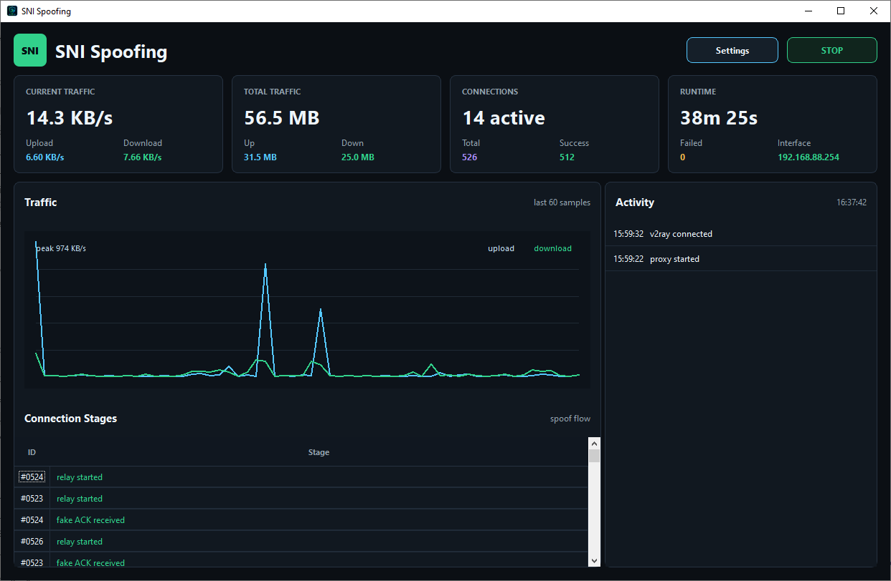

# SNI Spoofing (Public Build)

Public-facing project page for a Windows desktop tool written in Python.

This repository intentionally does **not** include the core/private source code.
It is provided for:

- product overview
- release notes
- installation guidance
- update tracking

## Tech Stack

- Python
- PySide6 (Windows desktop UI)
- PyInstaller (packaging to `.exe`)

## Why this repository is limited

The full implementation is private by design.  
This public repository is maintained to document the app and distribute release artifacts safely.

## Attribution

The initial core idea/prototype was inspired by:

- https://github.com/patterniha/SNI-Spoofing

For this public build and release line, additional engineering work was applied with a focus on:

- improved runtime stability
- bug fixes and safer error handling
- cleaner desktop UX and release packaging flow

This repository is an independently maintained distribution/documentation project and does not re-publish the private production core.

## Releases

Binary builds are published as ZIP artifacts (Windows x64), for example:

- `POOFING.ZIP`

If you are coming from social posts/reels, use the latest release package attached to the corresponding post.

## Preview

## Installation (Windows)

1. Download the latest ZIP build.
2. Extract to a local folder.
3. Run the executable as Administrator.
4. Configure your client as needed.

## Release Asset

Release package filename used in distribution:

- `POOFING.ZIP`

## Notes

- This software is intended for educational/research and interoperability testing.
- Make sure your usage complies with local laws and platform/network policies.

## Maintainer

- Creator: **TSCSAM**
- Publisher: **Digit Key**
- Telegram: **@digitkeey**
- GitHub: **[@TSCSAM](https://github.com/TSCSAM)**

## Changelog

See [CHANGELOG.md](./CHANGELOG.md).
